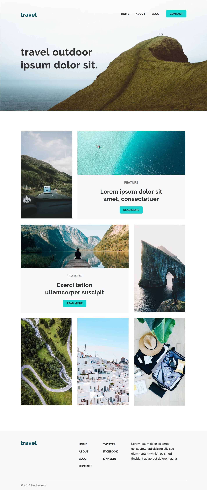

# HackerYou Intro to Web Dev/Advanced Web Dev Project - 1

This single-page site was built as part of the continuing education Intro to Web Development Development program at HackerYou. This was the first project within the course, and my first time working with HTML/CSS.

This project was completed April, 2019.

## Requirements
The project requiements were to create a functioning exact replica of a given client template image and font/colour specifications. 

## Screenshot of Requested Template
